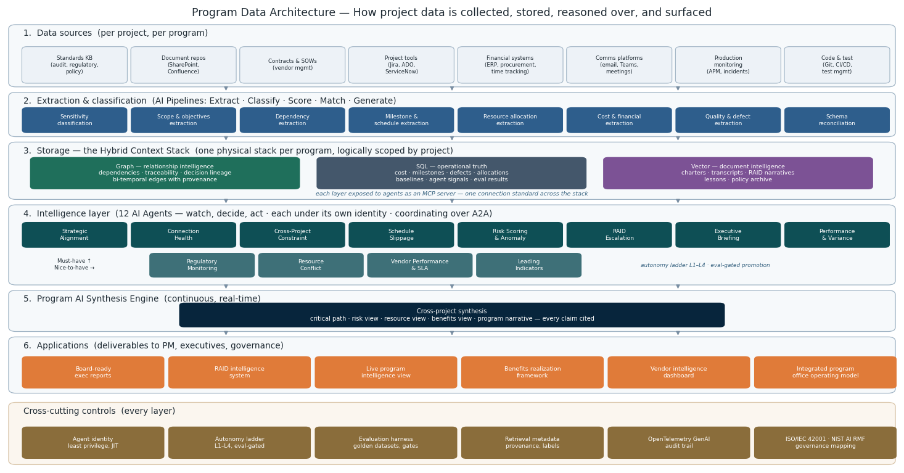

# The Program AI Architecture Standard

**An open standard for running IT programs on AI - auditable, governed, and vendor-neutral.**

**Version 1.0 - Request for Comments.** Comment period open through **October 1, 2026**. v1.1 ships Q4 2026 with substantive contributors credited by name.

**[Read the Standard (PDF)](Program%20AI%20Architecture%20Standard%20v1.0%20-%20RFC.pdf)** - [Markdown version](STANDARD.md) - [How to comment](CONTRIBUTING.md)

## Why this exists

Gartner expects over 40% of agentic AI projects to be cancelled within two years. McKinsey finds 62% of organizations experimenting with AI agents - and almost none scaling them. Four in five companies are deploying agents; fewer than half have any framework limiting what those agents may do unattended.

Those are not model failures. They are **architecture failures**: numbers nobody can trace, agents nobody scoped, retrieval nobody governed, autonomy nobody defined.

## The ten-point conformance test

A program office conforms to this standard when it can answer **yes** to all ten:

1. Every number an AI cites resolves to a SQL query in a system of record.
2. Every relationship claim resolves to a graph traversal - with validity intervals on the edges.
3. Every narrative claim carries provenance metadata a reader can click back to.
4. Every agent has a data contract: inputs, bundle, metadata, outputs, guardrails.
5. Every agent runs under its own least-privilege identity - no shared service accounts.
6. Every agent has a golden dataset and passed its evaluation gate before deployment.
7. Every agent action has a declared autonomy level, and promotions are eval-gated.
8. Agent telemetry is emitted in OpenTelemetry GenAI format into the observability platform you already run.
9. Data layers are exposed to agents via MCP; agent-to-agent coordination runs over A2A.
10. The controls above are mapped to ISO/IEC 42001 clauses or NIST AI RMF functions.

Points 1-3 govern what the AI may **claim**. Points 4-7 govern what an agent may **do**. Points 8-10 make it **observable and defensible** to the people who fund it.

## How to comment

This is a working document, published deliberately as an RFC. Open an [Issue](../../issues) using the comment template - one issue per point of feedback. The questions where disagreement is most valuable are listed in [CONTRIBUTING.md](CONTRIBUTING.md).

## License

(c) 2026 Anthony Filipovich, Latitude Consulting Inc. Released under [CC BY 4.0](LICENSE.md) - share it, adapt it, implement it (commercially too); keep the attribution.

*Stop using AI randomly. Start thinking in systems.*
